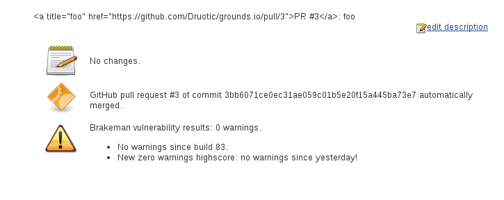
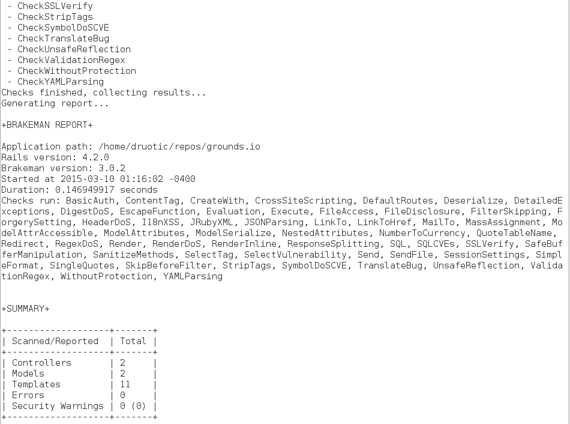
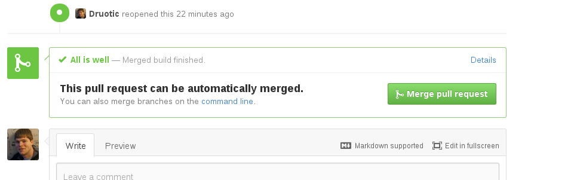
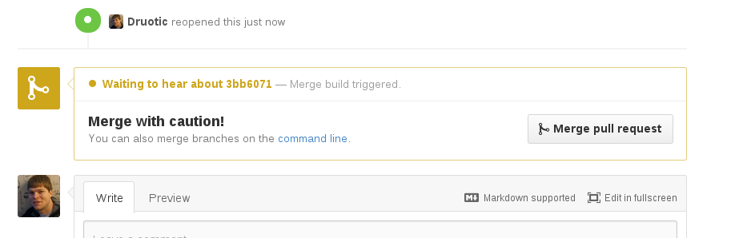
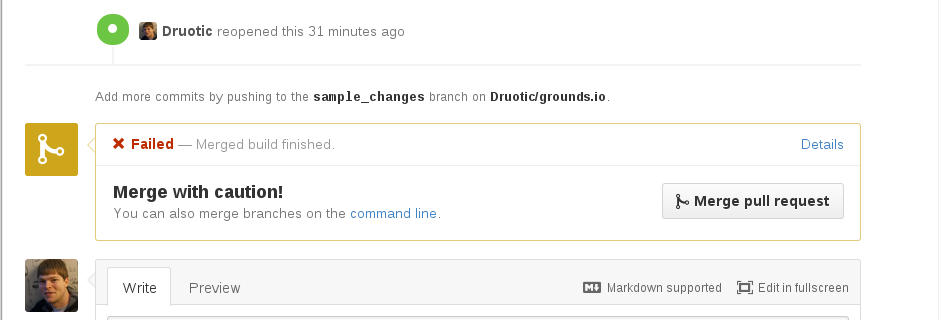

### Test & Analysis

For my continuous integration build/test tool, I chose to use [Jenkins](http://jenkins-ci.org/).  This takes care of the status
(via GUI) portion automatically.  Jenkins plugins for Git/Github allowed me to configure triggered 
builds when new commits are made to the master branch of the target application.

Application used: [GoundsIO](https://github.com/grounds/grounds.io) was selected as the application to
be built and tested.  It is a project which allows one to run code directly from the browser, and supports
multiple different languages (see [website](http://beta.42grounds.io/)).  More interestingly, the project
uses docker containers to run the application.  I chose this project primarily for this reason because
state is restored back to an initial starting point with each run (satisfying the clean state
requirement).

Jenkins supports running multiple builds via "executors."  This was easily configured, and in my case,
I chose to have three executors.

### Screenshots/Associated Functions

#### Unit Tests and Coverage Reporting

  
#### Analysis

Sample build - Brakeman reporting 0 warnings.  Despite it being successful (no vulnerabilities found),
the exclamation point icon makes it look like a warning.  This seems like an odd choice for "success",
but I left it 'as is' for now - it may be configurable.

**Sample Brakeman log output:**

#### Gate (Reject/warn PR on fail)

**Success:**

**Pending:**

**Failed:**

Note: I chose to leave it marked as caution/building, as opposed to completely rejecting and 
closing the pull request.  This leaves more control available to the developer. They can
choose whether to reject or merge in the event of experimental changes or other scenarios
where it is okay for master to be broken (this shouldn't normally be the case, but having the option
is still nice).

### Code (config)

  - The config.xml file which contains the configuration for the build has been included [here](https://github.com/Druotic/devops-project/blob/milestone2/config.xml).

### Other Notes

