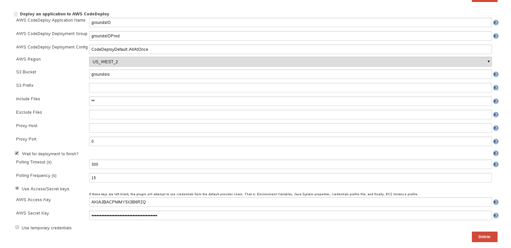
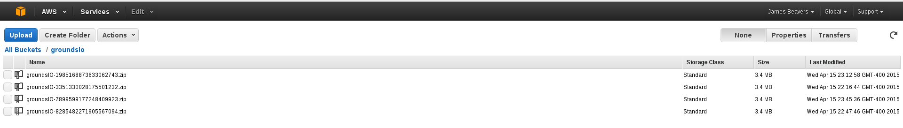
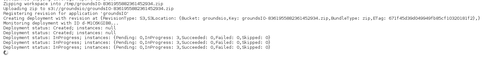
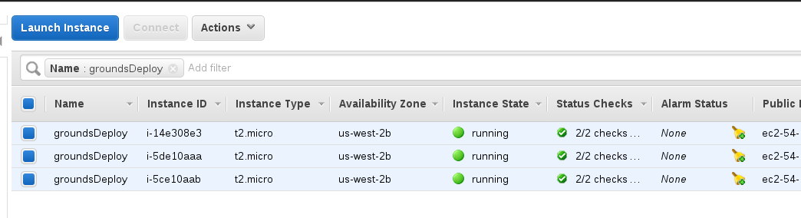
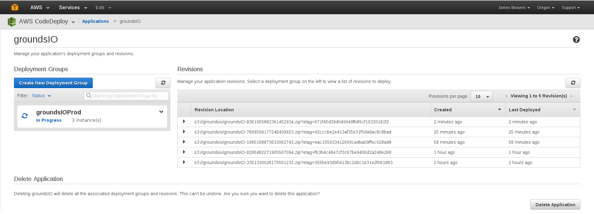

### Special Milestone

Application used: [GoundsIO](https://github.com/grounds/grounds.io) was selected as the application to
be built and tested.  It is a project which allows one to run code directly from the browser, and supports
multiple different languages (see [website](http://beta.42grounds.io/)).  More interestingly, the project
uses docker containers to run the application.  I chose this project primarily for this reason because
state is restored back to an initial starting point with each run (satisfying the clean state
requirement).

If you would like to see details about CI tool, deployment strategy, testing, etc, see milestone[1-3]
branches.

Application Pre-reqs (listening server + graphing): see [RUN.md](RUN.md)

For my special milestone, I have implemented a solution which analyzes the code that is entered inside
of the web console (and submitted).  It identifies keywords, counts the total number of occurrences,
and stores this information in a Redis cache.  Then, another script \<insert name\> can be run which will
pull the counts from Redis and plot a bar graph of the results using [Plotly](https://plot.ly/).

The bar graph is not visible in the deployment pipeline, instead a URL is returned wherever the script
was executed from.  The URL leads to a graph (on Plotly's website) which can be shared publicly or kept
private.  This URL is also stored in Redis and a route was created at \<IP\>:\<port\>/graph which will redirect
to the URLfor convenience.  Each time the \<script\> is run, the previous graph is replaced.

### Motivation

In a production environment (where many users are using GroundsIO), we would be able to collect lots of
sample code.  With this keywords extraction and visualization, we could potentially identify areas of
each language that are some combination of commonly used, important, less understood, difficult
conceptually, etc.  With this knowledge, introductory language instructors could better adjust their
curriculumn to focus on the parts of a language that are most important and/or difficult. In theory,
this would result is more effective instructors and better prepare student for their future.

However, you may notice the limitations of the keyword extraction.  Currently, [AlchemyAPI](http://www.alchemyapi.com/)
is being used for keyword extraction.  AlchemyAPI (at least, the keyword/entity extraction portion) is
really meant to be used for human languages, not coding languages. As a result, the keywords being
extracted aren't exactly what we want.  However, it was a starting point that was meant to demonstrate
the idea and could later be built upon by both replacing AlchemyAPI with a more appropriate NLP tool and
automate the graphing process (don't require running a script manually).

### Everything below is from previous milestone.

To be removed soon.

### Deployment

For my continuous integration build/test tool, I chose to use [Jenkins](http://jenkins-ci.org/).  This takes care of the status
(via GUI) portion automatically.  Jenkins plugins for Git/Github allowed me to configure triggered
builds when new commits are made to the master branch of the target application.

Jenkins supports running multiple builds via "executors."  This was easily configured, and in my case,
I chose to have three executors.

For deployment, I am using [AWS CodeDeploy](http://aws.amazon.com/codedeploy/) (with [EC2](http://aws.amazon.com/ec2/)),
[AWS S3](http://aws.amazon.com/s3/), and the Jenkin [AWS CodeDeploy plugin](https://wiki.jenkins-ci.org/display/JENKINS/AWS+Codedeploy+plugin).

### Screenshots/Associated Functions

#### Automatic deployment environment configuration:

This is handled by AWS CodeDeploy's [appspec.yml](appspec.yml) file.  In this file, configuration management details are specified (pre-install dependencies, etc).

#### Deployment of binaries created by build step:

The Jenkins AWS CodeDeploy plugin zips the build artifacts (the entire workspace) and pushes it to AWS S3.

**CodeDeploy Jenkins Plugin Config**

#### Remote deployment:

The Jenkins AWS CodeDeploy plugin then triggers a deployment to EC2 instances. The deployment setup is configured on the AWS CodeDeploy side.  In my case, I have 3 EC2 instances
which are all deployed to in parallel (there are other deployment configurations available as well).  Deployment steps are defined in an Appspec file.

**S3 Bucket Containing Zipped App Revisions**

**Copying Zip Over to S3 Bucket**

**EC2 Instances Used For Deployment**

**GroundsIO Application Defined For Deployment**

**CodeDeploy Deployment to Group (of 3 EC2 Instances) in Progress**

### Code (config)

  - [config.xml](config.xml) has been included. This is the Jenkins configuration file.

  - [appspec.yml](appspec.yml) has also been included, which is used by AWS CodeDeploy for configuration management.
