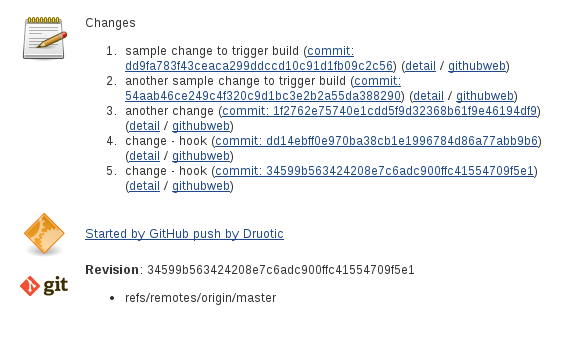
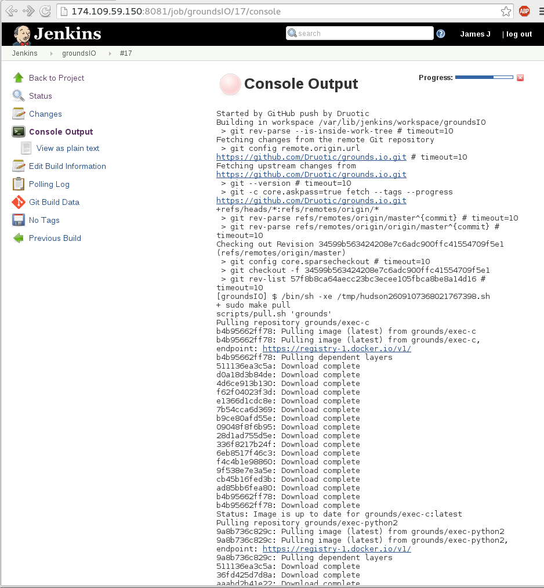
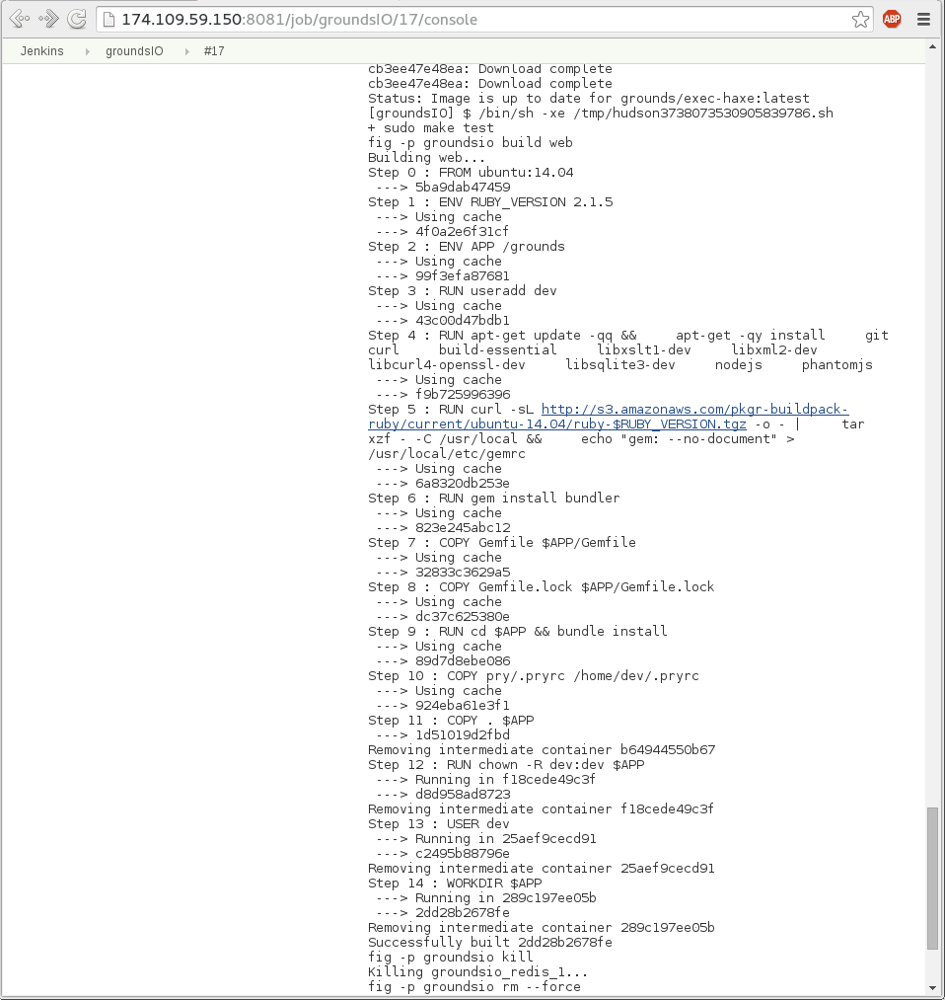
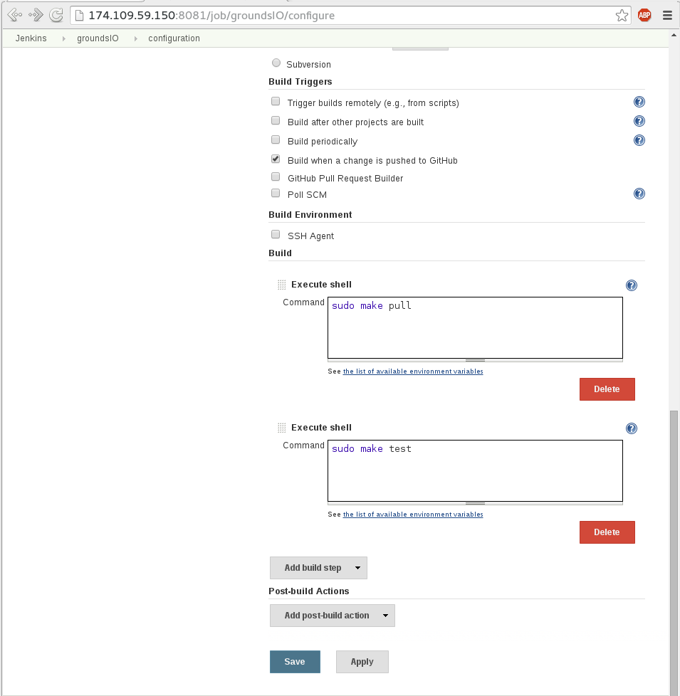
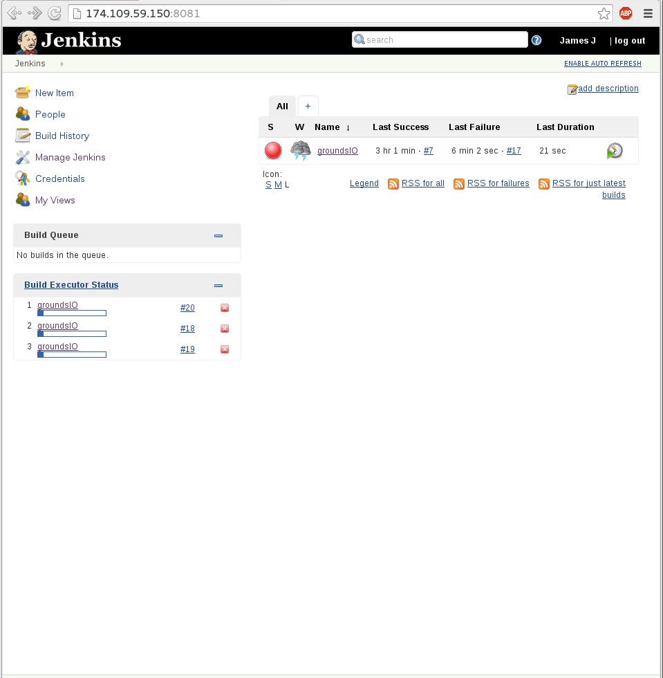
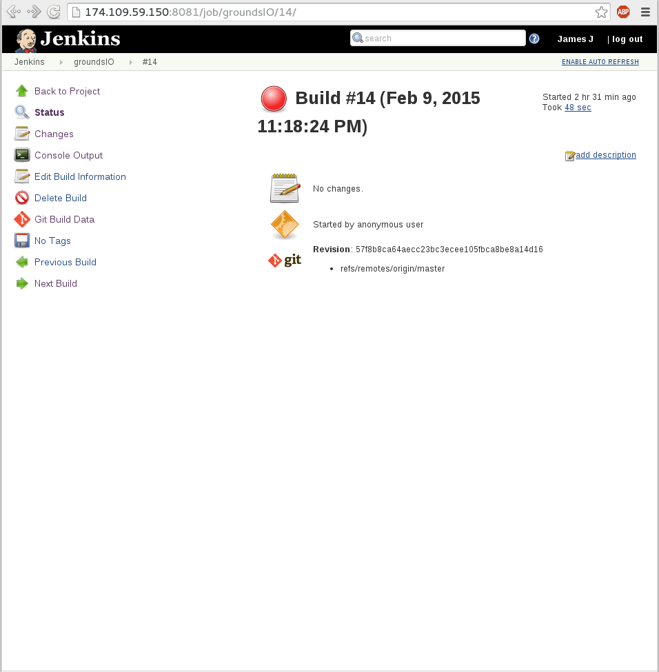

### Test & Analysis

For my continuous integration build/test tool, I chose to use [Jenkins](http://jenkins-ci.org/).  This takes care of the status
(via GUI) portion automatically.  Jenkins plugins for Git/Github allowed me to configure triggered 
builds when new commits are made to the master branch of the target application.

Application used: [GoundsIO](https://github.com/grounds/grounds.io) was selected as the application to
be built and tested.  It is a project which allows one to run code directly in the browser, and supports
multiple different languages (see [website](http://beta.42grounds.io/)).  More interestingly, the project
uses docker containers to run the application.  I chose this project primarily for this reason because
state is restored back to an initial starting point with each run (satisfying the clean state
requirement).

GroundsIO uses Make and Rake to facilitate building the project.  From my perspective, all I need to do
is run `make pull` to pull the necessary docker images, and `make test` to execute the tests.

Jenkins supports running multiple builds via "executors."  This was easily configured, and in my case,
I chose to have three executors.

### Screenshots/Associated Functions

##### Unit Tests and Coverage Reporting

  
Notice the "Started by GitHub push" line. (Build was triggered by a push to 
[master](https://github.com/druotic/grounds.io)) 

##### Test Generation/Exploration Technique

GroundsIO installs in Docker containers by default.  As a result, state is always reset back to the that of the initial image. As mentioned before, this was a motivating factor for picking this project. Make (shown) and Rake (not shown) are also used in GroundsIO for task handling and ensuring that tasks are repeatable. 

Rails Bundler is used by GroundsIO to handle dependencies (inside of the containers).

##### Base Analysis (Static Analysis)

Simple shell scripts used during the build process.  This project is relatively simple to set up, assuming the remote docker API has been set up (this was a pain to debug). Note that this is not part of the build process, it is a separate service which is not to be run on the slave.

##### Extended Analysis

Multiple executors running in parallel.  In this case, three different builds triggered in rapid succession (three pushes, each ~5-10 seconds apart).

##### Gate (Reject PR on fail)

A sample status page (before commit hooks were added).  Additional status information can be gathered via the console views, etc.

### Code (config)

  - The config.xml file which contains the configuration for the build has been included [here](https://github.com/Druotic/devops-project/blob/milestone2/config.xml).

### Other Notes

